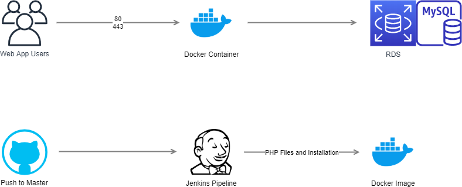
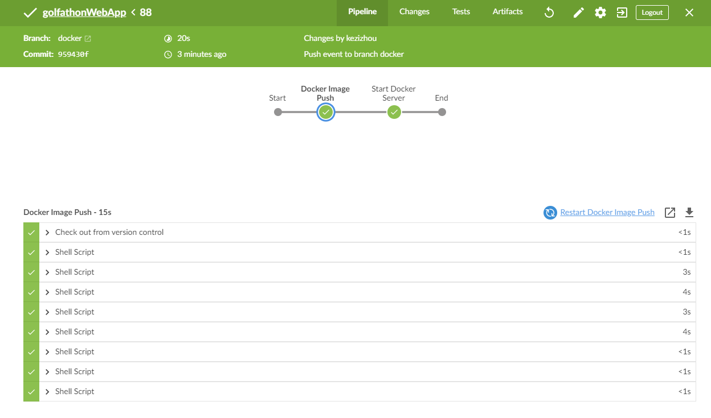

# golfathonWebApp
golfathonWebApp is a web application for a Golfathon Event. This application features enhancements that allow for increased security against XSS attacks, hashed password validation, and session timeout.

## Sections:  
[AWS](#aws)  
[Jenkins](#jenkins)  
[Chef "master" Branch](#1-chef---master-branch-master-branch)  
[Docker "docker" Branch](#2-docker---docker-branch-docker-branch)  
[Enhancements and Best Practices](#enhancements-and-best-practices)  
[Demonstrations of Website](#demonstrations-of-website)

### AWS
This web app utilizes AWS for infrastructure and security. 

AWS Setup:  

##### CloudFormation Templates
Templatized resources [here](https://github.com/kezizhou/golfathonWebApp/blob/master/aws/)

##### S3 Bucket

[Back to Top](#golfathonWebApp)

##### IAM
IAM Role: golfathon-role
* [Permissions:](https://github.com/kezizhou/golfathonWebApp/blob/master/aws/cft-iam-role-golfathon.yml)
    * EC2
    * S3
    * KMS
    * Logs

### Jenkins
The Jenkinsfiles allow for the automated build and push of images to Docker Hub, as well as pushing files to S3.  
[Back to Top](#golfathonWebApp)

There are 2 methods that could be used to automate this application, which have been separated by Git branches:  

### 1. Chef - "master" Branch
This branch contains a sample Chef cookbook that could be used to set up this web app. This becomes advantageous for larger applications, since this allows for better automation of the server install and setup. Even if the server is damaged, Chef can run the cookbook and bring the server back to the desired state.
In this method, the page can be viewed by going to the public DNS of the EC2 instance the server is running on. 
The Jenkinsfile in this branch pushes the PHP files from the repo to an S3 bucket.

  

[Back to Top](#golfathonWebApp)

### 2. Docker - "docker" Branch
This branch contains a Dockerfile that is used to build a Docker image of the application. This Dockerfile installs Apache, PHP, and MySQL, exposes the ports, and starts the services. It copies the PHP scripts and files from the repo to the container. This image can then be pulled from Docker Hub to the server(s). 
In this method, the Apache Docker container is exposed on ports 80, and the page can be viewed by going to http://localhost:80.

  

To see the Docker Hub repository for this application, please go [here]("https://hub.docker.com/repository/docker/kezizhou/golfathon-web-app").  

The Jenkinsfile in this branch builds the Docker image, pushes it to Docker Hub, and runs the image.  

[Back to Top](#golfathonWebApp)

### Enhancements and Best Practices
This project started as a basic web app that allowed for user interaction to submit data to a MySQL database. Since then, some enhancements have been made to follow best practices and to add features:
* Best Practices:
    * HTML headers have been moved to the default_header.php and admin_header.php files to avoid redundancy in code.
    * The mySQLConnect() function was created.
    * A custom InvalidCredentialException class was created to allow for catching invalid login exceptions as a specific exception.
    * In order to reduce unnecessary Docker image space, the Dockerfiles were changed to use an alpine image instead of an amazonlinux image. 
* Security:
    * Use of the password_verify() PHP function was added to allow for verification of hashed user passwords in the database.
    * The charConvert() function was created to guard against XSS attacks, and converts special characters to HTML entities anytime user input is output to the page.
* Enhancements:
    * A 60 minute session timeout was added to the admin page, which automatically redirects the user back to login.php along with a timeout message upon expiration. 
    * Adjustments were made to the navigation bar and tables to accomodate mobile devices  

[Back to Top](#golfathonWebApp)

### Demonstrations of Website
Default Page:

Admin Page:

Sample Login Timeout Page:

Responsive Table for Mobile Devices:  

Responsive Navigation Bar for Mobile Devices:  
  

[Back to Top](#golfathonWebApp)