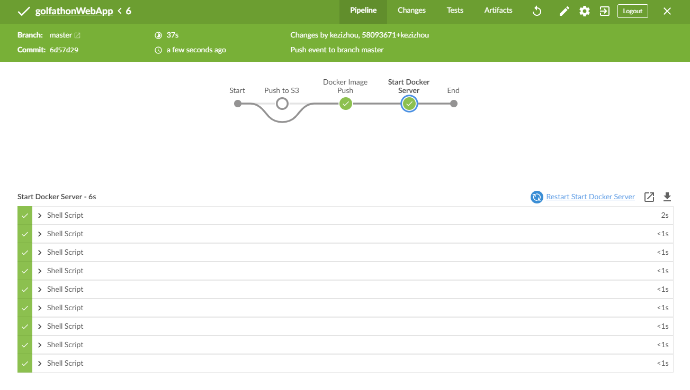

# golfathonWebApp
golfathonWebApp is a web application for a Golfathon Event that allows the user to register as a golfer, make donations, and view team statistics. It also allows admin users to sign in with credentials stored in a MySQL database. The admin page allows admins to create and manage corporate sponsorships, and edit sponsors of individual golfers. Application enhancements include security against XSS attacks, hashed password validation, and admin user session timeout.

This application runs on an Apache Web server with PHP. The design utilizes Jenkins technologies and Docker technologies such as Docker Secrets, Docker Swarm, and Docker Compose to allow for automation and increased security.  

## Sections:  
***
[AWS](#aws)  
[Jenkins](#jenkins)  
[Database](#database)  
[Docker "master" Branch](#1-docker---master-branch)  
[Chef "s3basic" Branch](#2-chef---s3basic-branch)  
[Enhancements and Best Practices](#enhancements-and-best-practices)  
[Demonstrations of Website](#demonstrations-of-website)  

***
### AWS
This web app utilizes AWS for infrastructure and security. 

#### CloudFormation Templates
Templatized resources [here](https://github.com/kezizhou/golfathonWebApp/blob/master/aws/)

#### S3 Bucket
  

#### IAM
IAM Role: [golfathon-role](https://github.com/kezizhou/golfathonWebApp/blob/master/aws/cft-iam-role-golfathon.yml)
* Permissions:
    * EC2
    * S3
    * KMS
    * Logs  

[Back to Top](#golfathonWebApp)

***
### Jenkins
The Jenkinsfiles allow for the automated build and push of images to Docker Hub, as well as pushing files to S3. The Jenkinsfile is triggered by pushes to the "master" and "s3basic" branches. 

* "master" Branch
    * Upon a push to the master branch, the Docker images for Apache and PHP are built and pushed to Docker Hub. A Docker Swarm is then created and initialized using Docker Compose.

* "s3basic" Branch
    * Upon a push to the s3basic branch, all files in the root directory of the GitHub Repo are pushed to an S3 bucket.

[Back to Top](#golfathonWebApp)

***
### Database
Please go [here](https://github.com/kezizhou/golfathonWebApp/blob/master/documentation/diagrams/golfathonERD.pdf) to see the Entity Relationship Diagram for the mySQL database of this application.

[Back to Top](#golfathonWebApp)

***
There are 2 methods that could be used to automate this application, which have been separated by Git branches:  

***
### 1. Docker - "master" Branch
This branch contains a Dockerfile that is used to build a Docker image of the application. This Dockerfile installs Apache, PHP, and MySQL functions, exposes the ports, and starts the services. It copies the PHP scripts and files from the repo to the container. This image can then be pulled from Docker Hub to the server(s). 
In this method, the Apache Docker container is exposed on ports 80, and the website can be viewed by going to http://[Public DNS of EC2 Instance]:80.

  

To see the Docker Hub repository for this application, please go [here]("https://hub.docker.com/repository/docker/kezizhou/golfathon-web-app").  

[Back to Top](#golfathonWebApp)

***
### 2. Chef - "s3basic" Branch
This branch contains a sample Chef cookbook that could be used to set up this web app. This becomes advantageous for larger applications, since this allows for better automation of the server install and setup. Even if the server is damaged, Chef can run the cookbook and bring the server back to the desired state.
In this method, all webpage components are loaded on the server itself, and the page can be viewed by going to the public DNS of the EC2 instance.

  

[Back to Top](#golfathonWebApp)

***
### Enhancements and Best Practices
This project started as a basic web app that allowed for user interaction to submit data to a MySQL database. Since then, some enhancements have been made to follow best practices and to add features:
* Best Practices:
    * HTML headers have been moved to the default_header.php and admin_header.php files to avoid redundancy in code.
    * The mySQLConnect() function was created for reuse.
    * A custom InvalidCredentialException class was created to allow for catching invalid login exceptions as a specific exception.
    * In order to reduce unnecessary Docker image space, the Dockerfiles were changed to use an Alpine image as opposed to other large Linux distro images such as CentOS and AmazonLinux. This also improves security by reducing the number of packages that could be attacked.
* Security:
    * Use of the password_verify() PHP function was added to allow for verification of hashed user passwords in the database.
    * The charConvert() function was created to guard against XSS attacks, and converts special characters to HTML entities anytime user input is output to the page.
    * Jenkins credentials and Docker secrets were used to avoid storing database credentials in a Docker image or on an open seerver.
* Enhancements:
    * A 60 minute session timeout was added to the admin page, which automatically redirects the user back to login.php along with a timeout message upon expiration. 
    * Adjustments were made to the navigation bar and tables to add responsive design for mobile devices  

[Back to Top](#golfathonWebApp)

***
### Demonstrations of Website
Default Page:

Admin Page:

Sample Login Timeout Page:

Responsive Table for Mobile Devices:  

Responsive Navigation Bar for Mobile Devices:  
  

[Back to Top](#golfathonWebApp)